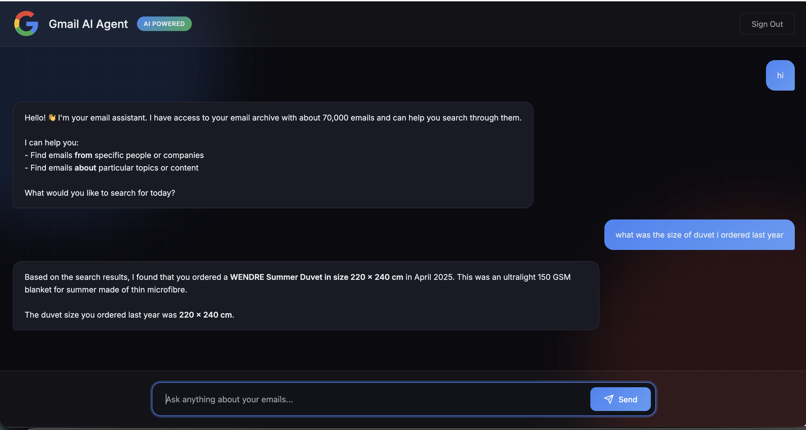

# My AI Assistant

AI-powered email assistant that exports Gmail to AWS and enables natural language search over ~70,000 emails.

## Project Structure

```
├── gmail-to-s3/          # Export Gmail to S3
└── email-agent-pinecone/ # AI agent with Pinecone vector search
```

## Components

### gmail-to-s3
Lambda function that exports Gmail emails to S3 using OAuth2. Handles large batch of emails with checkpointing for durability.

### email-agent-pinecone
The main AI agent - a web app with:
- LangChain React agent with Amazon Bedrock
- Two search tools (by sender, by content)
- Pinecone vector search with `llama-text-embed-v2`
- Cognito authentication
- CloudFront + S3 frontend

## Architecture


## Demo



## Tech Stack

- AWS Lambda (Python)
- Amazon Bedrock
- Pinecone (vector search)
- Amazon Cognito (auth)
- S3 + CloudFront (frontend)
- AWS SAM (IaC)

## License

MIT
